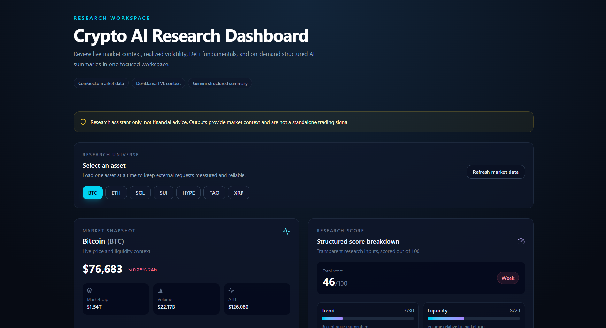

# Crypto AI Research Dashboard

A beginner-friendly research assistant for reviewing crypto market context, DeFi fundamentals, transparent scoring, and an on-demand structured AI summary. It is not a trading bot, does not provide financial advice, and does not generate guaranteed predictions.

## Why I Built This

Crypto research often requires checking price behavior, liquidity, risk, and available fundamentals across separate sources. I built this dashboard to bring those inputs into one focused interface while practicing a full-stack Next.js workflow with server-side API access, calculation-driven UI, and constrained AI output.

The project demonstrates how structured data can support research without turning a dashboard into a recommendation engine or automated trading system.

## Demo

**Live Demo:** [https://REPLACE_WITH_YOUR_VERCEL_DOMAIN.vercel.app](https://REPLACE_WITH_YOUR_VERCEL_DOMAIN.vercel.app)

Replace the placeholder demo URL with your actual Vercel deployment URL.

**Screenshot**

Place a dashboard screenshot at `public/screenshot-dashboard.png` before sharing the repository widely.



## Core Features

- Select a watchlist asset: BTC, ETH, SOL, SUI, HYPE, TAO, or XRP.
- View current price, market capitalization, volume, all-time-high context, and a 30-day chart.
- Calculate annualized 30-day realized volatility from historical daily closing prices.
- Review a transparent research score with explanatory categories and notes.
- Show DeFi total value locked (TVL) context where it is relevant and available.
- Generate an optional Gemini analyst summary from the currently displayed structured data only.
- Preserve usable cached market data when CoinGecko is temporarily unavailable or rate limited.

## Project Highlights

- Full-stack Next.js dashboard.
- Live crypto market data from CoinGecko.
- DeFi fundamentals from DeFiLlama.
- Realized 30D volatility calculation.
- Simplified research scoring model.
- Gemini-powered AI summary based only on structured data.
- API key handling through environment variables.
- Graceful error handling for external API failures.

## Tech Stack

- Next.js App Router
- TypeScript
- Tailwind CSS
- Recharts
- lucide-react

## Data Sources

- **CoinGecko**: market snapshot and historical chart data.
- **DeFiLlama**: chain TVL history used for DeFi fundamentals where applicable.
- **Gemini API**: on-demand structured analyst summary.

API keys are used only in server-side routes and are never sent to the browser.

## Research Score Methodology

The score is a research-support framework from 0 to 100:

| Category | Maximum | Input |
| --- | ---: | --- |
| Trend | 30 | Recent 7-day and 30-day price momentum |
| Liquidity | 20 | Trading volume relative to market capitalization |
| Volatility | 15 | Annualized 30-day realized volatility |
| Drawdown | 15 | Distance from all-time high with trend context |
| Fundamental | 20 | 30-day DeFi TVL change when relevant and available |

Missing DeFi fundamentals or insufficient volatility data are treated neutrally rather than as a negative signal.

## AI Summary

The Gemini summary is generated only after the user clicks **Generate AI Summary**. It receives the selected asset's market snapshot, research score, realized volatility, and available DeFi context. It does not receive chart history and is instructed to use no external narratives or unsupported facts.

The output is intended as a concise structured data summary and is not a standalone trading signal. Gemini is prompted to avoid external narratives, unsupported facts, financial advice, exact price predictions, or recommendation language.

## Technical Decisions

- **Next.js App Router:** keeps pages and server-side API routes in one readable full-stack project structure.
- **Server-side API requests:** keeps CoinGecko and Gemini credentials out of browser code and centralizes provider error handling.
- **Structured JSON for Gemini:** restricts the summary to data already visible in the dashboard and reduces unsupported narrative generation.
- **Research-support scoring:** makes the methodology explainable while avoiding recommendation or financial-advice framing.
- **No funding-rate module in this MVP:** an earlier Binance funding experiment was intentionally removed because local network/DNS reliability made that data source unsuitable for a stable portfolio demo.

## Setup

1. Install dependencies:

   ```powershell
   npm.cmd install
   ```

2. Create `.env.local` from `.env.example` and add your own keys:

   ```env
   COINGECKO_API_PLAN=demo
   COINGECKO_API_KEY=your_coingecko_key_here
   GEMINI_API_KEY=your_gemini_key_here
   ```

   CoinGecko can use its public demo endpoint without a key, although a valid demo key may reduce access problems. Gemini summaries require a valid Gemini API key.

3. Start the development server:

   ```powershell
   npm.cmd run dev
   ```

4. Open [http://localhost:3000](http://localhost:3000).

## Verification

```powershell
npm.cmd run typecheck
npm.cmd run build
```

## Limitations

- Research scores are simplified and educational; they are not decision signals.
- CoinGecko and Gemini free tiers may apply rate limits that temporarily affect individual cards.
- DeFi metrics may not apply to every supported asset.
- Volatility is calculated from the available 30-day historical price window and is one risk context measure only.
- AI output is limited to the structured dashboard inputs and can still require human review.
- The AI endpoint is appropriate for local MVP use; add server-side abuse protection before any public hosting.
- This MVP is not a trading system and has no accounts, database, portfolio tracking, automated actions, or deployment configuration.

## Disclaimer

This project is a research assistant only. Its research score is simplified and educational. It does not provide financial advice, generate guaranteed predictions, or act as a standalone trading signal.

## What I Learned

- Building a full-stack Next.js application with the App Router and TypeScript.
- Creating API routes that keep third-party API keys on the server.
- Fetching and normalizing market data from CoinGecko and DeFi metrics from DeFiLlama.
- Calculating annualized realized volatility from historical daily closing prices.
- Designing a simplified, explainable research scoring methodology.
- Using Gemini only with structured app data to reduce hallucination risk.
- Handling API rate limits, unavailable metrics, cached fallback data, and isolated UI errors gracefully.

## How to Present This Project

This project is an AI-assisted crypto research dashboard built to combine market data, DeFi fundamentals, volatility analytics, and structured AI summaries into one research workspace. It does not provide trading signals or financial advice. Instead, it demonstrates how external data APIs, scoring logic, and AI can be combined safely for decision-support workflows.

**Short description for GitHub About or LinkedIn:**

> AI-assisted crypto research dashboard using Next.js, CoinGecko, DeFiLlama, Gemini API, and a simplified research scoring engine.

## Future Roadmap

- Portfolio tracking.
- More robust scoring methodology.
- News and sentiment module.
- Additional on-chain metrics.
- Historical score tracking.
- User-defined watchlists.
- Better charting and visual comparison tools.
- Backtesting research score behavior for analysis only.

## Local Test Checklist

Run the following checklist before committing or deploying the project:

```powershell
npm.cmd install
npm.cmd run typecheck
npm.cmd run build
npm.cmd run dev
```

Then open [http://localhost:3000](http://localhost:3000) and confirm market data,
DeFi context, score calculation, and on-demand Gemini summaries behave as expected.

## Deployment on Vercel

1. Push this project to GitHub.
2. Import the GitHub repository into Vercel.
3. In Vercel Project Settings, add these environment variables:

   ```env
   COINGECKO_API_PLAN=demo
   COINGECKO_API_KEY=your_coingecko_key_here
   GEMINI_API_KEY=your_gemini_key_here
   ```

4. Redeploy after adding or updating environment variables.

Do not upload `.env.local` to GitHub. Configure real keys only in your local
environment or Vercel project settings. CoinGecko and Gemini free tiers may
apply rate limits.

## GitHub Commit and Push

Review and commit the local project:

```powershell
git status
git add .
git commit -m "build crypto ai research dashboard mvp"
```

To publish to a new GitHub repository, replace `YOUR_USERNAME` before running:

```powershell
git remote add origin https://github.com/YOUR_USERNAME/crypto-ai-research-dashboard.git
git branch -M main
git push -u origin main
```
